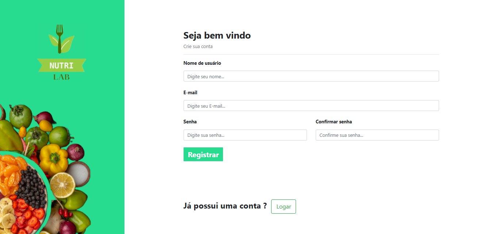
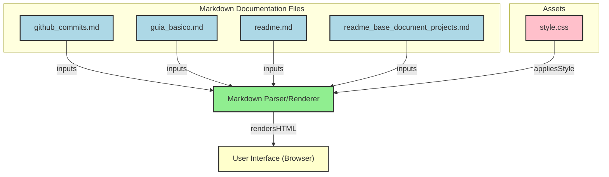

# 🌐 Nutri Lab
<div align="center">
  
</div>

<p align="center">
  <a href="https://github.com/guedes-jr/django-NutriLab">
    
  </a>
  <a href="https://github.com/guedes-jr/django-NutriLab/issues">
    
  </a>
  <a href="https://github.com/guedes-jr/django-NutriLab/network">
    
  </a>
  <a href="https://github.com/guedes-jr/django-NutriLab/stargazers">
    
  </a>
  <a href="https://github.com/guedes-jr/django-NutriLab/blob/main/LICENSE">
    
  </a>
</p>

## 📝 Sumário

- [Sobre o Projeto](#%EF%B8%8Fsobre-o-projeto)
- [Tecnologias Utilizadas](#-tecnologias-utilizadas)
- [Funcionalidades](#-funcionalidades)
- [Requisitos](#-requisitos)
- [Instalação](#-instalação)
- [Diagrama de Fluxo de Processo](#-diagrama-de-fluxo-de-processo)
- [Scripts Disponíveis](#-scripts-disponíveis)
- [Estrutura de Pastas](#-estrutura-de-pastas)
- [Contribuindo](#-contribuindo)
- [Licença](#-licença)
- [Contato](#-contato)

## 🛠️ Sobre o Projeto

O **Nutri Lab** é uma aplicação web desenvolvida com o framework Django, projetada para oferecer uma experiência prática e intuitiva no gerenciamento de usuários e dados relacionados à nutrição. Este projeto foi criado com o objetivo de aprendizado e exploração das funcionalidades do Django, além de boas práticas de desenvolvimento web. Ele combina um backend robusto com uma interface moderna e responsiva, proporcionando uma base sólida para projetos futuros.

## 🧰 Tecnologias Utilizadas

- **[Django](https://www.djangoproject.com/):** Framework web Python que facilita o desenvolvimento rápido e seguro de aplicações robustas.
- **[Python](https://www.python.org/):** Linguagem de programação versátil e poderosa utilizada para o desenvolvimento do backend.
- **[SQLite](https://www.sqlite.org/):** Banco de dados leve e eficiente, ideal para projetos de pequeno a médio porte.
- **[HTML5](https://developer.mozilla.org/pt-BR/docs/Web/HTML):** Linguagem de marcação para a estruturação das páginas web.
- **[CSS3](https://developer.mozilla.org/pt-BR/docs/Web/CSS):** Estilização das páginas, garantindo uma interface visual atraente e responsiva.
- **[Bootstrap](https://getbootstrap.com/):** Framework CSS para design responsivo e componentes reutilizáveis.
- **[JavaScript](https://developer.mozilla.org/pt-BR/docs/Web/JavaScript):** Linguagem de programação para adicionar interatividade às páginas.

## ✨ Funcionalidades

- Autenticação de usuários com sistema de login e registro.
- CRUD completo para gerenciamento de clientes, incluindo:
  - Cadastro de novos clientes.
  - Edição de informações dos clientes.
  - Exclusão de registros.
  - Listagem detalhada de clientes.
- Gerenciamento de dietas, permitindo:
  - Criação e personalização de planos alimentares.
  - Acompanhamento do progresso dos clientes em relação às dietas.
  - Atualização de metas e ajustes no plano alimentar.
- Interface responsiva e moderna para facilitar o uso em diferentes dispositivos.
- API interna para comunicação eficiente entre o backend e o frontend.
- Relatórios e visualizações do progresso dos clientes.

## 📋 Requisitos

Para executar o projeto **Nutri Lab**, você precisará das seguintes ferramentas instaladas no seu ambiente de desenvolvimento:

- **[Python 3.10 ou superior](https://www.python.org/downloads/):** Linguagem de programação utilizada no backend.
- **[Node.js 14 ou superior](https://nodejs.org/):** Necessário para gerenciar dependências do frontend e executar scripts.
- **[SQLite](https://www.sqlite.org/):** Banco de dados relacional utilizado para armazenar os dados da aplicação.
- **[Git](https://git-scm.com/):** Para clonar o repositório e gerenciar o controle de versão.

### Dependências do Projeto

- **Backend:**
  - Django e bibliotecas relacionadas (listadas no `requirements.txt`).
  - Banco de dados configurado no `settings.py`.

### Requisitos Opcionais

- **[Docker](https://www.docker.com/):** Para criar contêineres e facilitar o ambiente de desenvolvimento.
- **[Visual Studio Code](https://code.visualstudio.com/):** IDE recomendada para desenvolvimento, com extensões para Python e JavaScript.

## 🚀 Instalação

### 1. Clonando o Repositório

Primeiro, clone o repositório do projeto para o seu ambiente local:

```bash
git clone https://github.com/guedes-jr/django-NutriLab.git
cd django-NutriLab
```

### 1. Criando e Ativando o Ambiente Virtual

Crie um ambiente virtual para isolar as dependências do projeto:

```bash
python3 -m venv venv
```

Ative o ambiente virtual:

Linux/MacOS:
```bash
source venv/bin/activate
```
Windows:
```bash
venv\Scripts\activate
```

3. Instalando as Dependências
Com o ambiente virtual ativado, instale as dependências listadas no arquivo `requirements.txt`:
```bash
pip install -r requirements.txt
```

4. Configurando o Banco de Dados
Antes de executar o projeto, aplique as migrações para configurar o banco de dados:
```bash
python3 manage.py makemigrations

python3 manage.py migrate
```

5. Executando o Servidor de Desenvolvimento
Inicie o servidor Django para verificar se a aplicação está funcionando corretamente:
```bash
python3 manage.py runserver
```

Acesse a aplicação no navegador através do endereço `http://127.0.0.1:8000`.


## 📦 Scripts Disponíveis

Na raiz do projeto, você pode rodar os seguintes comandos:

- **Iniciar o servidor de desenvolvimento Django:**
  ```bash
  python manage.py runserver
  ```
- **Criar migrações para o banco de dados:**
  ```bash
  python manage.py makemigrations
  ```
- **Aplicar migrações ao banco de dados:**
  ```bash
  python manage.py migrate
  ```
- **Criar um superusuário para acessar o painel administrativo:**
  ```bash
  python manage.py createsuperuser
  ```
- **Coletar arquivos estáticos (em produção):**
  ```bash
  python manage.py collectstatic
  ```
- **Executar os testes automatizados:**
  ```bash
  python manage.py test
  ```

## 🧭 Diagrama de Fluxo de Processo
> Link para gerar mermaid https://gitdiagram.com/


## 📁 Estrutura de Pastas

```plaintext
├── autenticacao
│   ├── __init__.py
│   ├── admin.py
│   ├── apps.py
│   ├── models.py
│   ├── templates
│   │   └── cadastro.html
│   ├── tests.py
│   ├── urls.py
│   └── views.py
├── db.sqlite3
├── docs
│   └── img
│       └── banner_project.png
├── manage.py
├── nutri_lab
│   ├── __init__.py
│   ├── asgi.py
│   ├── settings.py
│   ├── urls.py
│   └── wsgi.py
├── readme.md
├── requeriments.txt
└── templates
    ├── base.html
    └── static
        └── autenticacao
            ├── css
            │   └── cadastro.css
            ├── img
            │   ├── fundo_background.png
            │   └── logo_nutri_lab.png
            └── js
```
> Comando utilizado para mostrar a estrutura de dados `tree -I 'node_modules' -I '__pycache__' -I 'migrations' -I 'venv'`.

## 🤝 Contribuindo

Contribuições são bem-vindas! Sinta-se à vontade para abrir uma issue ou enviar um pull request.

1. Faça um fork do projeto
2. Crie uma nova branch (`git checkout -b feature/nova-funcionalidade`)
3. Commit suas alterações (`git commit -m 'Adiciona nova funcionalidade'`)
4. Faça o push para a branch (`git push origin feature/nova-funcionalidade`)
5. Abra um Pull Request

## 📄 Licença

Este projeto está licenciado sob a Licença MIT - veja o arquivo [LICENSE](LICENSE) para detalhes.

## 📧 Contato

👤 **Seu Nome**

- Github: [@guedes-jr](https://github.com/guedes-jr)
- LinkedIn: [João Guedes](https://www.linkedin.com/in/jo%C3%A3o-guedes-36a440135)
- Email: joao.guedes.developer@gmail.com

---

Desenvolvido com profissionalismo por [João Guedes](https://github.com/guedes-jr) 🤖.